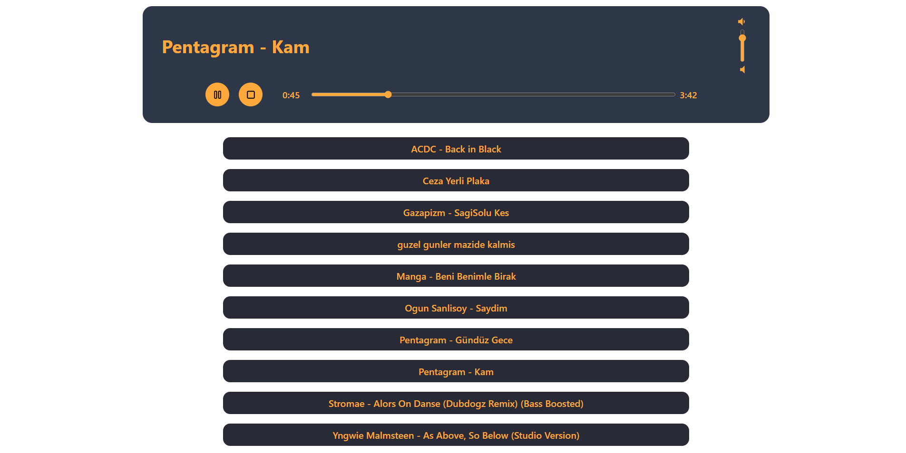
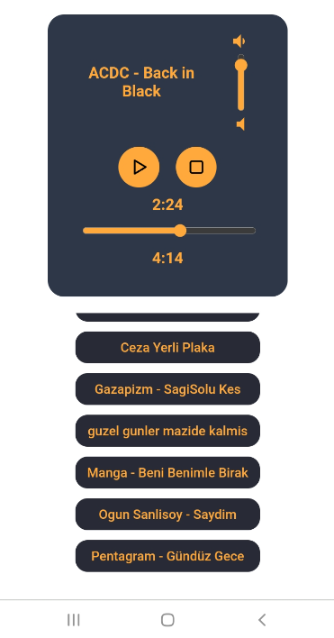

# Socket.IO Collaborative Music Player


### Tech Stack

**Spring Boot**

**Netty Socket IO:** socket server

**mp3spi:** getting music file properties (duration, size)

**webflux:** for serving mp3 resource

&nbsp;

### How to run

#### clone the project: https://github.com/gurkanucar/mp3-player-be

```bash
  git clone https://github.com/gurkanucar/mp3-player-be
```

#### run

```bash
  cd mp3-player-be
  
  mvn spring-boot:run
```

### Note that!
**You have to configure mp3 folder location and then insert some musics**

open the **"application.properties"** file

server.base_path=**D:\\music**  # write your mp3 folder location

then open the **"ServerCommandLineRunner"** file

insert musics:

        fileService.save(FileModel.builder().name("music name").build());

## Example Video:

[https://www.youtube.com/watch?v=IfaBerTl_PI](https://www.youtube.com/watch?v=IfaBerTl_PI)

## Example Images:







### Frontend:

[https://github.com/gurkanucar/mp3-player-fe](https://github.com/gurkanucar/mp3-player-fe)
